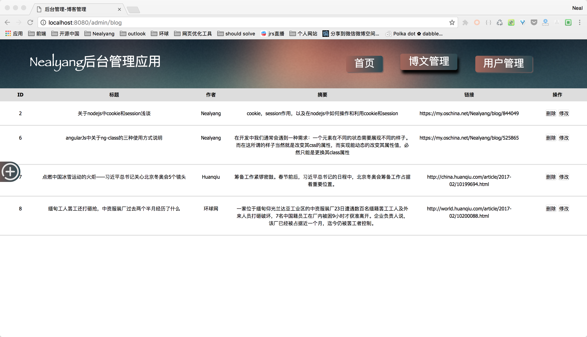
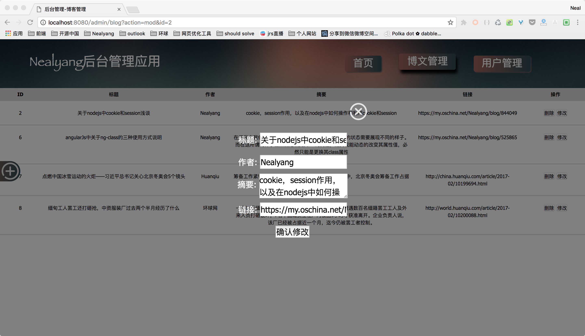
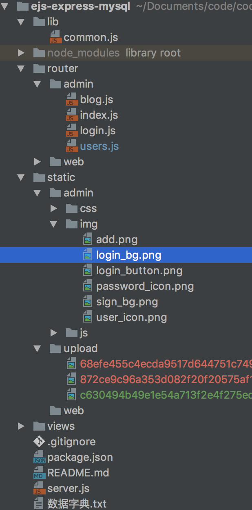

 ejs-express-mysql
 ==
 基于express，MySQL，ejs实现的一个简单基本的网站后台管理应用
 --
##前言
也是这两周才正式的接触node，虽然在前端开发中我们常常说前后端分离，但是在学习过程中，个人感觉还是要刁难刁难自己的。因为用ejs来写前端页面。
项目主要实现用户的登录，session的存储和加密（准确的说是签名），数据库的CRUD，包括图片的上传，删除和修改等基本功能。
---
喜欢的朋友方便的话可以给个star  (＾－＾)V

顺便推广一波nodejs技术交流群，群号:209530601
***

>ejs mysql nodejs express express-router...

##效果图
整体操作流程图

**GIF Brewery转gif真的有点。。。好吧，不吐槽了，后面会分开讲解每一步，好在基本操作还能看得清~**

登录页

后台管理首页

博文管理

用户管理页

操作

##开发准备
关于开发前期的准备，这里就不多说了，说实话，自己也没有准备啥，关于nodejs环境，MySQL配置啥的就多少了，关于本项目的[数据字典](./数据字典.txt)，还有[SQL文件](./resources/blog.sql)已经在目录里了，这里主要说下后端开发的每一个步骤
##项目目录
项目目录

##整体架构
项目重点在后端开发中，web端页面并没有涉及到，后端管理流程大致如下:
* 路由控制分为admin，web，还是那句话，我们操作全部在admin中
* 跳转到admin拦截所有的请求，判断用户是否登录
* 未登录则重定向到登录，登陆成功后设置session。[不懂session？点击这里](https://my.oschina.net/Nealyang/blog/844049)
* 登录后则可进行相关的操作，数据的增删改查等功能。
##后端开发
###后台基本架构、路由设置
        const express = require('express');
        const expressStatic = require('express-static');
        const bodyParser = require('body-parser');
        const multer = require('multer');
        const multerObj = multer({dest:'./static/upload'});
        const cookieParser = require('cookie-parser');
        const cookieSession = require('cookie-session');
        const consolidate = require('consolidate');
        const ejs = require('ejs');
        
        //创建服务器
        var server = express();
        server.listen(8080);
        
        //解析请求数据
        
        server.use(bodyParser({
            extended:false
        }));
        server.use(multerObj.any());
        
        //设置cookie，session
        server.use(cookieParser('Neal_signed'));
        (function () {
            var arr = [];
            for(var i = 0;i<10000;i++){
                arr.push('keys_'+Math.random());
            }
            server.use(cookieSession({
                name:'session_id',
                keys:arr,
                maxAge:20*60*1000//一般我会设置20分钟，这里是为了感受session过期~~带来的快感~?(●´∀｀●)ﾉ
            }))
        })();
        
        //设置模板
        server.set('view engine','html');
        server.set('views','./views');
        server.engine('html',consolidate.ejs);
        //设置路由
        server.use('/admin',require('./router/admin/index')());
        server.use('/',require('./router/web/index')());
        
        
        //静态文件的请求
        server.use('/files',expressStatic('./static'));
我的基本架构如下，关于每一部分的功能，都已经标注。关于路由的控制在admin/index.js跟server.js大同小异，我想大家也都应该知道了。
###登录功能
登录功能这里主要说两点
* 密码的md5签名（当然，大多数人说是md5加密）
* session的应用
在lib中存放着自己写的一些方法，作为一个库，admin初始化有三个用户，包括u/p：root,neal,Nealyang
关于密码的签名方法主要如下：
        var crypto = require('crypto');
        
        module.exports = {
            MD5_SUFFIX : 'JDSAIOEUQOIoieuoiqv#$%^&dhfja)(* %^&FGHJfyuieyfhfhak(^.^)YYa!!\(^o^)/Y(^o^)Y(*^__^*)ﾍ|･∀･|ﾉ*~●',
            md5:function (pwd) {
                var md5 = crypto.createHash('md5');
                return md5.update(pwd).digest('hex');
            }
        };
MD5_SUFFIX是加密字符串，用法如路由login.js：

        
            router.post('/',function (req,res) {
                var username = req.body.username;
                var password = common.md5(req.body.password+common.MD5_SUFFIX);
                if(username && password){
                    db.query('SELECT * FROM admin_table WHERE username="'+username+'"',function (err,userData) {
                        if(err){
                            console.error(err);
                            res.status(500).send({code:500,data:[],msg:'database error'});
                        }else if(userData.length == 0){
                            res.status(400).send({code:400,data:[],msg:'parameters error'});
                        }else{
                            if(userData[0].password != password){
                                res.status(400).send({code:400,data:[],msg:'username or password error'});
                            }else{
                                req.session['user_id'] = userData[0].ID;//注意这里是在req上面
                                res.status(200).send({code:200,data:[],msg:'success'});
                            }
                        }
                    })
                }else{
                    res.status(400).send({code:400,data:[],msg:'parameters error'});
                }
            });

从上面的代码中也展现了什么时候设置session，下面是所有请求的拦截判断：

        router.use(function (req,res,next) {
                if(!req.session['user_id'] && req.url != '/login'){
                    res.redirect('/admin/login');
                }else{
                    next();
                }
            });

##

